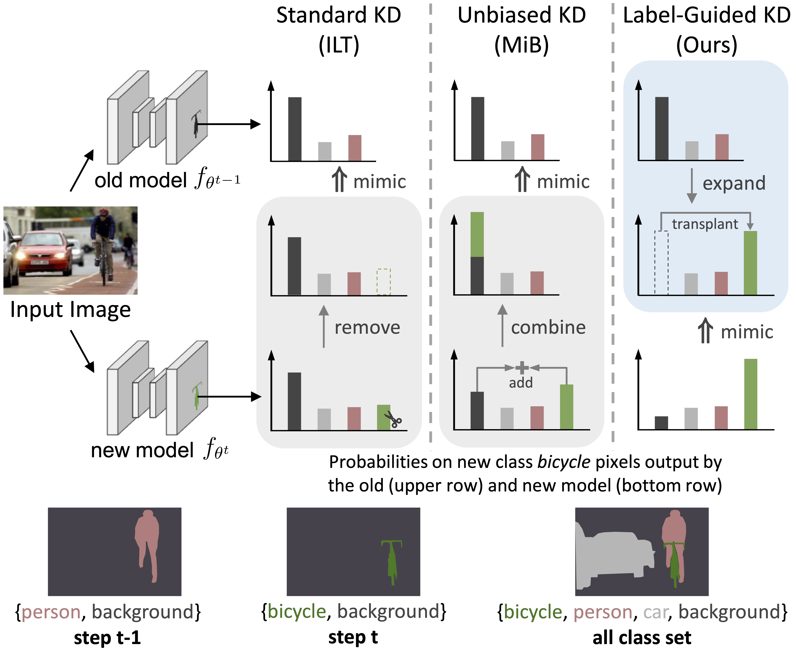

<div align="center">

## LGKD: Label-Guided Knowledge Distillation for Continual Semantic Segmentation on 2D Images and 3D Point Clouds

[](https://openaccess.thecvf.com/content/ICCV2023/papers/Yang_Label-Guided_Knowledge_Distillation_for_Continual_Semantic_Segmentation_on_2D_Images_ICCV_2023_paper.pdf)


</div>

Existing knowledge distillation based continual semantic segmentation (CSS) methods continue to suffer from the confusion between the background and novel classes.
To address this issue, we propose a new label-guided knowledge distillation (LGKD) loss for CSS, which builds a reliable **class correspondence** across incremental steps and alleviates the **novel-background confusion**.
The figure below illustrates the distinction of our proposed LGKD loss from existing arts.
<div align="center">
  
</div>

This repository contains the official implementation for [LGKD](https://openaccess.thecvf.com/content/ICCV2023/papers/Yang_Label-Guided_Knowledge_Distillation_for_Continual_Semantic_Segmentation_on_2D_Images_ICCV_2023_paper.pdf), built upon [Douillard et al.'s repository](https://github.com/arthurdouillard/CVPR2021_PLOP).
If you find it useful, please consider to cite our paper:
```BibTeX
@inproceedings{yang2023label,
  title={Label-guided knowledge distillation for continual semantic segmentation on 2d images and 3d point clouds},
  author={Yang, Ze and Li, Ruibo and Ling, Evan and Zhang, Chi and Wang, Yiming and Huang, Dezhao and Ma, Keng Teck and Hur, Minhoe and Lin, Guosheng},
  booktitle={Proceedings of the IEEE/CVF International Conference on Computer Vision},
  pages={18601--18612},
  year={2023}
}
```

## Installation

This repo is tested with the following environment (see [environment.yml](environment.yml) for details) on 2x RTX 3090, though it may also work with other versions.
- Python (3.8.12)
- Pytorch (1.10.2+cu11.3.1)
- apex (0.1)
- [inplace-abn](https://github.com/mapillary/inplace_abn) (1.1.0)

Readily setup with the following command lines. Do remember to check your own cuda version.
```bash
# pytorch installation
conda install pytorch torchvision pytorch-cuda=12.1 -c pytorch -c nvidia

# other required packages
pip install matplotlib inplace_abn tensorboardX tensorboard termcolor

# apex installation
git clone https://github.com/NVIDIA/apex
cd apex
# if pip >= 23.1 (ref: https://pip.pypa.io/en/stable/news/#v23-1) which supports multiple `--config-settings` with the same key... 
pip install -v --disable-pip-version-check --no-cache-dir --no-build-isolation --config-settings "--build-option=--cpp_ext" --config-settings "--build-option=--cuda_ext" ./
# otherwise
pip install -v --disable-pip-version-check --no-cache-dir --no-build-isolation --global-option="--cpp_ext" --global-option="--cuda_ext" ./
```

## Dataset

Download ADE20k and Pascal-VOC 2012 with the scripts in the `data` folder.
Feel free to create a symbolic link instead if you already have a local copy of the standard PASCAL-VOC benchmark.

**Expected dataset structure for PASCAL VOC 2012:**

    PascalVOC2012
    ├── VOCdevkit               # standard Pascal VOC benchmark
    │   ├── (VOC2007)           # optional, will not be downloaded by the script
    │   │   ├── ImageSets
    │   │   └── ...
    │   └── VOC2012
    │       ├── ImageSets
    │       └── ...
    ├── SegmentationClassAug
    ├── SegmentationClassAug_Visualization
    └── list
**Expected dataset structure for ADE20k:**

    ADEChallengeData2016          # standard ADE20k benchmark
    ├── annotations
    ├── images
    ├── objectInfo150.txt
    └── sceneCategories.txt

## Getting Started

We used the pretrained model released by the authors of [In-place ABN](https://github.com/mapillary/inplace_abn#training-on-imagenet-1k).
Create a directory named `./pretrained` and download the [weights](https://github.com/Ze-Yang/LGKD/releases/download/v1.0/resnet101_iabn_sync.pth.tar) of ResNet pretrained on ImageNet.

### Train & Evaluation with script

To reproduce our results, simply run the corresponding script (VOC 15-1 for example):
```bash
bash scripts/voc/lgkd_15-1.sh
```

- Note that you will need to specify your own data path.
- By default, we use 2 GPUs. Change the batch size accordingly if you use different number of GPUs.
For instance, double the batch size if you train on a single GPU.

### Evaluation in command line

To evaluate the trained models, run
```bash
torchrun --master_port free_port --nproc_per_node=1 run.py --data_root path/to/data --overlap --batch_size 12 --dataset voc --name LGKD --task 15-5s --step 5 --method LGKD --opt_level O1 --ckpt model_to_test.pth --test
```

### Pretrained Models
We provide a set of pre-trained models for download so that one can choose to skip the long training phase of step 0.

| Dataset | Setting | background | old | all | Download |
|:-----:|:-----:|:-----:|:-----:|:-----:|:-----:|
| VOC | 19-1 | 94.0 | 77.3 | 78.2 | [19-1-voc.pth](https://github.com/Ze-Yang/LGKD/releases/download/v1.0/19-1-voc.pth) |
| VOC | 15-5 | 94.5 | 79.8 | 80.8 | [15-x-voc.pth](https://github.com/Ze-Yang/LGKD/releases/download/v1.0/15-x-voc.pth) |
| VOC | 15-1 | 94.5 | 79.8 | 80.8 | [15-x-voc.pth](https://github.com/Ze-Yang/LGKD/releases/download/v1.0/15-x-voc.pth) |
| ADE20k | 100-50 | 35.4 | 42.9 | 42.8 | [100-50-ade.pth](https://github.com/Ze-Yang/LGKD/releases/download/v1.0/100-50-ade.pth) |
| ADE20k | 100-10 | 36.5 | 42.8 | 42.7 | [100-10-ade.pth](https://github.com/Ze-Yang/LGKD/releases/download/v1.0/100-10-ade.pth) |
| ADE20k | 50-50 | 44.9 | 49.4 | 49.3 | [50-ade.pth](https://github.com/Ze-Yang/LGKD/releases/download/v1.0/50-ade.pth) |

## License
This repository is released under [CC BY-NC 4.0 License](LICENSE). The codes are for educational and non-commercial research purpose only.
 
The copyright belongs to Nanyang Technological University & Hyundai Motor Company.